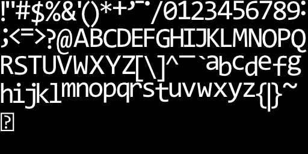

# mv_easy_font

Simple font renderer library written in Opengl 3.3 using stb_truetype.h to load a packed bitmap into texture of a .ttf font. 

Uses instanced rendering, so that only position, index and color of each glyph have to be updated instead of updating two triangles of vertex attributes per glyph. 

Inspired by stb_easy_font.h.

### Usage
Compile the example program with 
```bash
gcc main.c -Iinclude -lglfw
```

To use mv_easy_font.h in any running opengl project, define MV_EASY_FONT_IMPLEMENTATION before including mv_easy_font.h in one .c/.cpp file, and include mv_easy_font.h wherever else needed. Simply call mv_ef_draw() with the appropriate parameters to draw text:
```C
mv_ef_draw(str, col, offset, font_size, res);
```

### Dependencies

mv_easy_font.h depends on stb_truetype.h and calls the OpenGL API, so make sure all the relevant OpenGL symbols and functions are loaded using something like GLEW, GLAD or whatever floats your boat.

You can optionally choose to use include stb_image_write.h (for generating font.png) and stb_rect_pack.h (for more efficient packing)

At the moment there are two shader files that need to be visible to the executable. These will probably be inlined in the near future.

console.ttf is hardcoded at the moment, so that will also have to be available in the current working directory when running.

The example code uses GLFW and GLAD, but those should not be required, as long as opengl symbols are loaded properly.

### TODO

- Add a way to specify what .ttf file to use, and a way to specify the font size in pixels instead of hard coding. 

- Inline shader codes for less files to include

### Screenshot:


### Font bitmap


